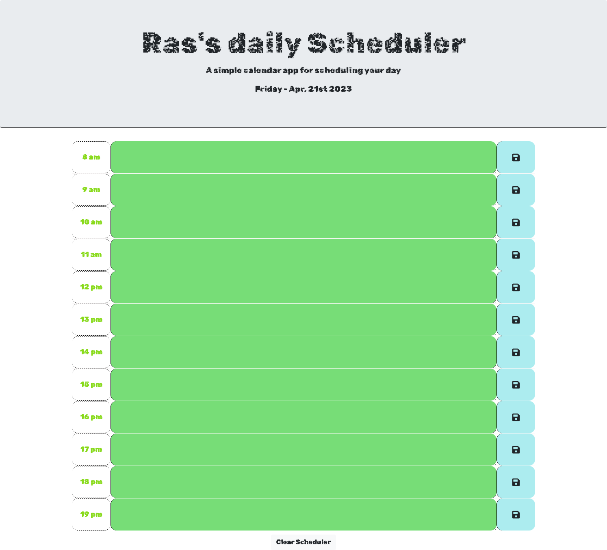

# 05 Weekly Project- Day Scheduler

## Table of Contents

1. [About](#About)
2. [Languages Used](#languages-used)
3. [The Task](#the-task)
4. [Install](#install)
5. [Screenshots](#screenshots)
6. [Links](#links)
7. [acknowledgements](#acknowledgements)
8. [credit](#credit)

---

## About

A simple Work day Scheduler that allows a user to save events for each hour of the day.

---

## Languages Used

- HTML
- CSS
- Javascript
- jQuery
- Moment.js

## The Task

### Acceptance Criteria

- GIVEN I am using a daily planner to create a schedule
   

- WHEN I open the planner
   
- THEN the current day is displayed at the top of the calendar

   

- WHEN I scroll down
   
- THEN I am presented with time blocks for standard business hours
   
- WHEN I view the time blocks for that day
   
- THEN each time block is color-coded to indicate whether it is in the past, present, or future
   
- WHEN I click into a time block
   
- THEN I can enter an event
   
  WHEN I click the save button for that time block
   

- THEN the text for that event is saved in local storage
   
- WHEN I refresh the page
   
- THEN the saved events persist

## Install

- [Git](https://github.com/git-guides/install-git)
- [SSH Key](https://docs.github.com/en/authentication/connecting-to-github-with-ssh/adding-a-new-ssh-key-to-your-github-account)
- [Github Account](https://docs.github.com/en/get-started/onboarding/getting-started-with-your-github-account)
- [Google Chrome](https://support.google.com/chrome/answer/95346?hl=en&co=GENIE.Platform%3DDesktop)

## Screenshots:

## links

- [Github Repo](https://github.com/mdRashed30/Quiz-Game-Challenege-4)
- [Deployed Page](https://mdrashed30.github.io/Quiz-Game-Challenege-4/)

## acknowledgements :

-- Video Tutorial

- [Moment.js](https://devhints.io/moment)

## Credit:

Special thanks to my friends who help me -

-- Indrojit Ghosh
